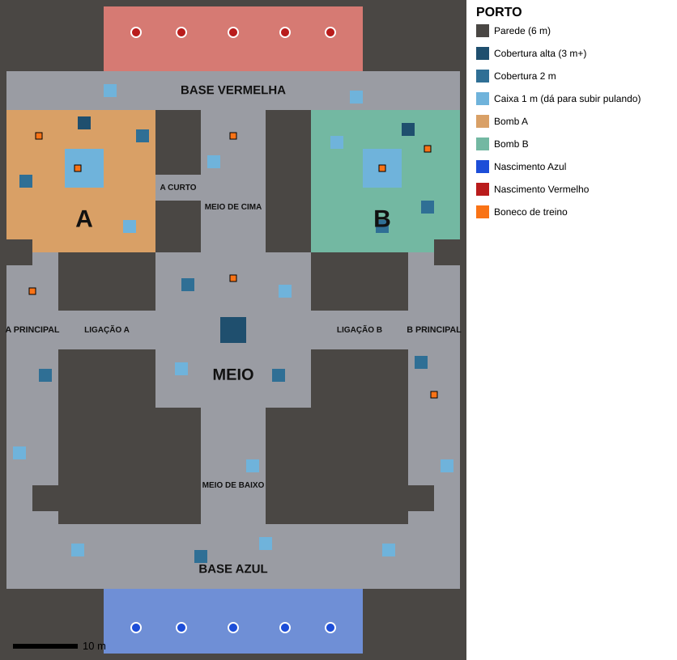
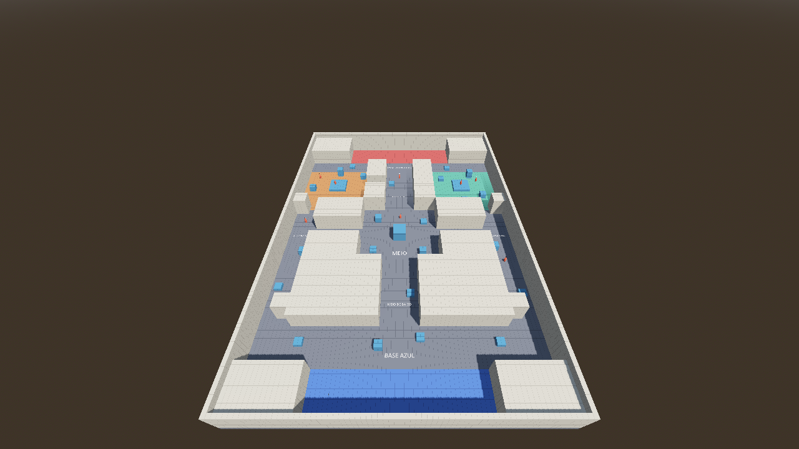
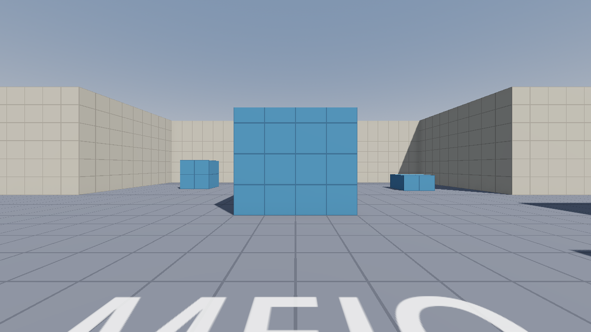

# Passo 05: Mapa Porto (greybox)

**O que foi feito:** a Fase 6 do [roadmap](00-roadmap.md). O primeiro mapa do jogo, o **Porto**, já abre com **F5**.

---

## 1. Por que o mapa é original (e não uma cópia do Valorant)

A ideia era deixar o mapa **muito parecido com os do Valorant**. Por isso pesquisei como a Riot faz os mapas dela. Mesmo assim, **não usamos mapas tirados do Valorant**:

- Os mapas, modelos e texturas do Valorant pertencem à **Riot Games**. Os arquivos "prontos" que circulam no GitHub foram extraídos do jogo sem permissão.
- Como o nosso repositório é **público**, a Riot pode pedir a remoção dele (DMCA), e o projeto inteiro sai do ar.
- O **jeito de desenhar** um mapa, por outro lado, é livre: três rotas, meio disputado, bombs A e B, entradas estreitas. É isso que copiamos.

### O que os designers da Riot contam sobre os mapas

| Princípio | Como aplicamos no Porto |
|---|---|
| O Ascent foi feito como "uma experiência tática clássica de **três rotas**" e virou o modelo para todos os outros mapas | Rotas **A Principal**, **Meio** e **B Principal** |
| Todo mapa começa como **greybox** (só blocos), e a jogabilidade vem antes da arte | Mapa todo em blocos, com grade de 1 m para medir |
| Cada mapa tem **algo próprio** (portas no Ascent, teleportes no Bind) | Atalho **A Curto**, que só existe do lado A |
| Os bombs ficam em **lugares diferentes entre si** | Bombs em lados opostos, com coberturas diferentes |
| **Visual limpo:** detalhe só abaixo de 0,3 m ou acima de 2,7 m, para a cabeça dos personagens se destacar sempre | Paredes lisas, sem enfeites na altura do corpo |
| Os mapas de **mata-mata** (Piazza, District, Kasbah) têm um meio aberto com várias ligações | Pátio do meio com torre e ligações para as duas rotas |

---

## 2. Áreas do mapa (callouts)

Os nomes aparecem **escritos no chão** do jogo.

| Área | Onde fica | O que é |
|---|---|---|
| **Base Azul** | Sul | Nascimento do time Azul (ataque no modo futuro de bomba) |
| **Base Vermelha** | Norte | Nascimento do time Vermelho (defesa) |
| **A Principal** | Rota da esquerda | Corredor longo até o Bomb A, com uma curva e uma entrada estreita |
| **B Principal** | Rota da direita | Igual à A Principal, do lado B |
| **Meio de baixo** | Centro-sul | Corredor da Base Azul até o pátio |
| **Meio** | Centro | Pátio aberto com uma **torre** de 3,5 m no centro |
| **Meio de cima** | Centro-norte | Corredor do pátio até a Base Vermelha |
| **Ligação A / Ligação B** | Lados do pátio | Passagens do pátio para as rotas A e B |
| **A Curto** | Entre o meio de cima e o Bomb A | Atalho estreito, só do lado A |
| **Bomb A / Bomb B** | Noroeste / Nordeste | Áreas coloridas com plataforma de 1 m e coberturas |

### Medidas

| Item | Valor |
|---|---|
| Tamanho do mapa | 70 × 100 m |
| Altura dos prédios | 6 m (muro de fora: 8 m) |
| Coberturas | 1 m (dá para **subir pulando**), 2 m e 3 m ou mais |
| Base → pátio do meio | ~46 m (cerca de 6,5 s correndo com Shift), igual para os dois times |
| Base Azul → Bomb A | ~94 m (cerca de 13 s correndo) |
| Base Vermelha → Bomb A | ~38 m (a defesa chega antes, como no Valorant) |

---

## 3. Como jogar no mapa

1. Aperte **F5**: o jogo abre no Porto. Você nasce na **Base Azul**.
2. Há **8 bonecos** do time Vermelho espalhados: nos bombs (2 em cada, um deles andando), no pátio, no meio de cima e nas rotas.
3. Tudo continua valendo: placar, Tab, Esc, deslize etc.

Para treinar na sala antiga, abra `scenes/sala_de_treino.tscn` no Godot e aperte **F6** (roda a cena aberta).

---

## 4. Como mexer no mapa

O mapa está em `jogo/scenes/mapas/porto.tscn`. Dentro dele:

| Nó | O que tem |
|---|---|
| `Mapa/Chao` | O chão |
| `Mapa/Zonas` | Chão colorido dos bombs e das bases (sem colisão) |
| `Mapa/Blocos` | Paredes, prédios e coberturas. Cada bloco tem um nome, por exemplo `A_Plataforma` ou `Meio_Torre` |
| `Mapa/Nomes` | Nomes escritos no chão |
| `Spawns/Azul` e `Spawns/Vermelho` | Pontos de nascimento |
| `Bonecos` | Bonecos de treino |

**Para mover ou mudar o tamanho de um bloco:**
1. Clique nele na lista à esquerda (por exemplo `Mapa/Blocos/Meio_Torre`).
2. Arraste as setas coloridas para mover.
3. No Inspetor, em **Size**, mude largura (x), altura (y) e profundidade (z).

**Para criar uma cobertura nova:** selecione uma caixa parecida e aperte **Ctrl+D** (duplicar). Depois mova a cópia.

Dica: use a **grade de 1 m** do chão para medir. Cada quadradinho tem 1 metro.

---

## ✅ Checklist desta etapa

- [ ] O jogo abre no Porto com F5
- [ ] Consigo ir da Base Azul aos dois bombs pelas três rotas
- [ ] Consigo subir pulando nas caixas de 1 m e nas plataformas dos bombs
- [ ] Os nomes das áreas aparecem no chão
- [ ] Dá para usar o A Curto do meio de cima para o Bomb A

## ➡️ Próximo passo

Depois do mapa entrou o **minimapa**: veja [06-minimapa.md](06-minimapa.md).

---

## Fontes da pesquisa

- [The design behind Ascent explained (THESPIKE.GG)](https://thespike.gg/valorant/news/the-design-behind-ascent-explained/317)
- [VALORANT map design explained by Riot devs (ONE Esports)](https://www.oneesports.gg/valorant/valorant-map-design-explained-riot-devs/)
- [The Creation of Split (Riot Games)](https://playvalorant.com/en-us/news/dev/the-creation-of-split)
- [Team Deathmatch in Valorant: maps, rules (AFK Gaming)](https://afkgaming.com/esports/guide/team-deathmatch-in-valorant-maps-rules-release-date)
