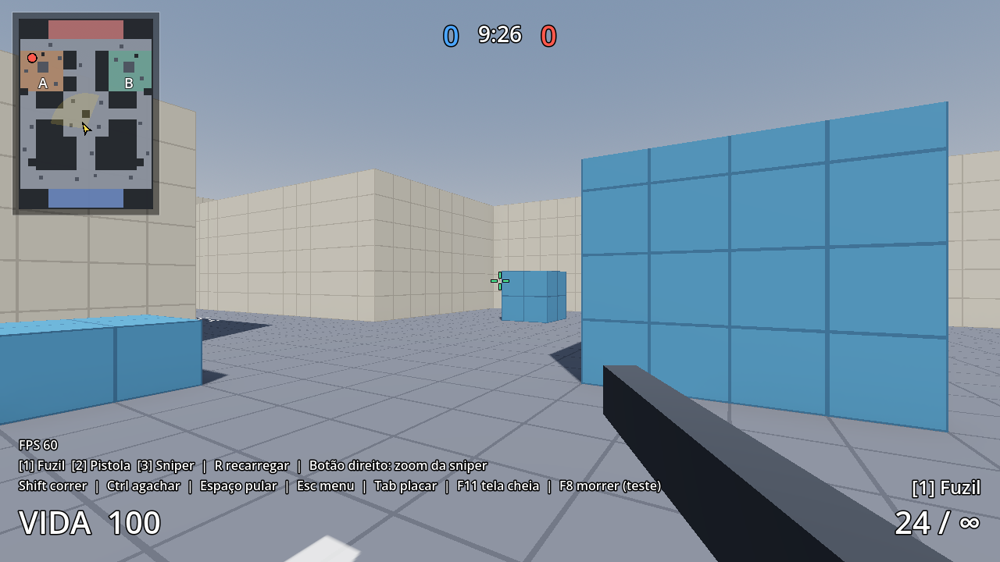

# Passo 06: Minimapa

**O que foi feito:** um minimapa no canto superior esquerdo, como no Valorant. **Quem atira aparece no minimapa dos inimigos por alguns segundos.**

---

## 1. O que aparece no minimapa

| Ícone | O que é |
|---|---|
| Seta amarela + cone claro | **Você** e para onde está olhando (o cone tem o mesmo campo de visão da câmera) |
| Bolinha azul | **Aliado** (aparece sempre) |
| Bolinha vermelha | **Inimigo que atirou**. Aparece por **3 segundos** depois de cada tiro |
| Anel vermelho crescendo | O tiro acabou de acontecer |
| Bolinha vermelha piscando | O inimigo está quase sumindo do minimapa |
| Cinza claro / escuro / preto | Chão / cobertura baixa / parede |
| Laranja e verde, com "A" e "B" | Bomb A e Bomb B |

O minimapa fica com o **norte para cima** (a base Vermelha em cima e a Azul embaixo). Quem morre some do minimapa.

**Você também é revelado:** quando você atira, os inimigos te veem no minimapa deles por 3 segundos. Isso já está pronto para o multiplayer.

## 2. Como testar

1. Aperte **F5** e clique em **Treinar sozinho no Porto**.
2. Os bonecos **2** (Bomb A), **4** (Bomb B) e **5** (pátio do meio) **fingem que atiram** a cada 4, 5 e 6 segundos. Eles piscam em laranja, não causam dano e aparecem em vermelho no minimapa.
3. Ande pelo mapa e veja a seta e o cone acompanharem você.

Essa opção de fingir tiro serve **só para teste**. Ela fica no Inspetor do boneco, em `Simulate Shot Interval` (0 = desligado).

## 3. Como ajustar

| O que | Onde |
|---|---|
| Tempo que o inimigo fica visível depois de atirar | Nó **TeamDeathmatch** → `Reveal Time` (padrão 3 s) |
| Tamanho do minimapa | `scripts/ui/minimap.gd` → `MAP_SIZE` (padrão 260 pixels) |
| Cores | `scripts/ui/minimap.gd` → constantes `..._COLOR` |
| Letras no minimapa | Coloque um **Label3D** do mapa no grupo `minimap_label` (aba **Nó → Grupos** no Godot) |

## 4. Como funciona (para quem for programar)

- O minimapa **se desenha sozinho** a partir das caixas (`CSGBox3D`) do nó do mapa. Ele lê o tamanho e a altura de cada caixa:
  - caixa sem colisão: área colorida;
  - topo no chão: chão;
  - até 2,5 m: cobertura;
  - acima disso: parede.

  Então um mapa novo feito com caixas já ganha minimapa **sem configurar nada**. Basta apontar `map_path` no nó **HUD** para o nó do mapa.
- Revelar quem atira: a arma emite `fired` → o jogador emite `shot_fired` → o `TeamDeathmatch` chama `reveal(jogador)` → o minimapa pergunta `reveal_time_left(inimigo)` a cada quadro.
- No multiplayer, o servidor é quem vai avisar os outros jogadores que alguém atirou.

---

## ✅ Checklist desta etapa

- [ ] O minimapa aparece no canto superior esquerdo com o desenho do mapa
- [ ] A seta amarela gira quando giro o mouse
- [ ] Os bonecos que fingem atirar aparecem em vermelho por 3 s e somem
- [ ] Na sala de treino o minimapa também funciona

## ➡️ Próximo passo: Fase 7, multiplayer 5v5

Feito! Veja [07-multiplayer.md](07-multiplayer.md).
